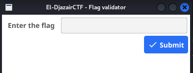
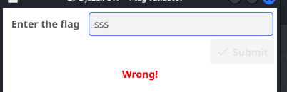
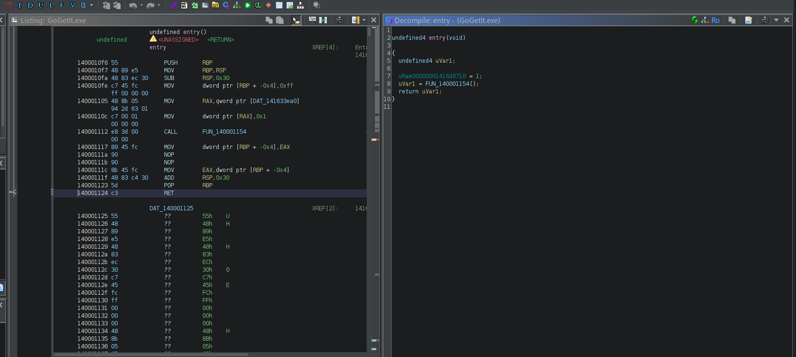
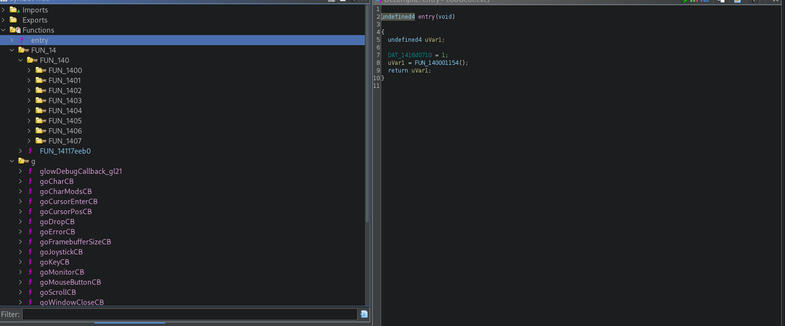
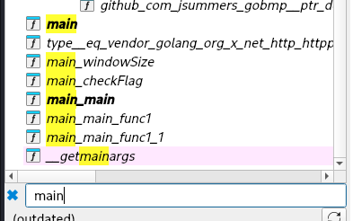
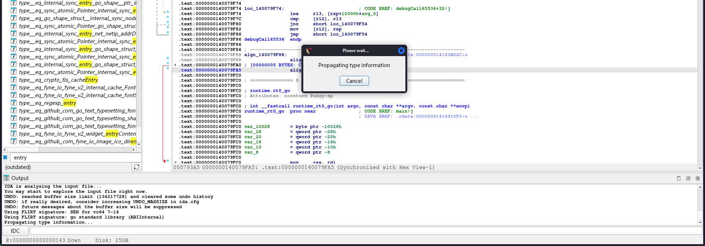
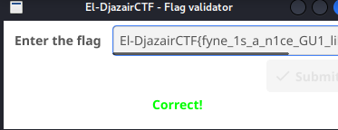

# **Go Get It (Reverse)**

In the challenge we get a [windows executable](https://github.com/MedjberAbderrahim/CTF-Writeups/blob/main/El-Djazair%20CTF/GoGetIt.exe) (.exe), which spawns a simple flag-checking GUI application.

## **Reconnaissance**

First, we start by gaining basic knowledge on the binary, or as I call it, *reconnaissanse*, using some simlpe linux commands:

```bash
└─$ file GoGetIt.exe             
GoGetIt.exe: PE32+ executable for MS Windows 6.01 (GUI), x86-64 (stripped to external PDB), 12 sections
```

We immediately notice the '**stripped**' keyword, which means it's an executable stripped of its function names, which is generally used to increase the difficulty of reversing the binary, and making it use less space.

We try to run `strings` on the binary, and catch any non-manipualted flag, but nothing too useful comes out.

## Dynamic Analysis

We try starting the app to check its external behaviour, basically what we can 'see' and 'do', we can run it using windows with OpenGL libraries downloaded, or from linux using [wine](https://www.winehq.org)



aha, a typical input field demanding the flag, we try putting some inputs, and we notice it prints a big, red "Wrong!"



So we can understand that we need to find the required and correct flag to submit, and so we go to static analysis to understand the program better.

## Static Analysis

### Ghidra
We startr by decompiling the binary with [ghidra](https://github.com/NationalSecurityAgency/ghidra), which gets us to the entry function:



As the binary is stripped, we don't have a 'main' function, only an executable's entry.

Inspecting some functions' names confirms me this is a golang-compiled binary, which is inherently different from C/C++'s binaries:



I decide to switch to IDA, as it's known to be better for handling Go-Compiled binaries in general, I have, and will use, IDA Pro 9.0 for this.

### IDA
IDA Clearly Gives us a better disassembly and clariy overall, in this use-case.
We try to locate the main function:



By matching with the output of the dynamic analysis, we notice there are a lot of GUI functions and keywords in the `main_main()` function, which indicates it's the main function.

After some times (maybe it has already happened to you), IDA freezes and we notice this message:



Now you mostly have 2 choice, either force the pop-up and crash IDA, or wait for it to finish the propagation (~4 minutes for me), and you'll notice IDA has become extremly slow, and may only get faster after some time, this is because IDA has loaded and resolved too many types,it's kinda overheating, which is due to the way Go packages its binaries, which would include everything used, like a static C-binary.

If you have a problem with this, and want to remove it, follow my solution [here](#avoiding-type-propagation-problem)

## Reading Code

Now with `main.main` all sorted out, we can start understanding the inner workings of the program.

Either by fully reading it or sending it to AI, we understand that the operations for the submissions (the part we care the most about) are in the function `main_main_func1`, which yields the following disassembly, where we notice the usage of the function `main_checkFlag`:

```C
// main.main.func1
__int64 __golang main_main_func1(__int64 a1, __int64 a2, __int64 a3, int a4, int a5, int a6, int a7, int a8, int a9){
    __int64 v9; // rdx
    __int128 v10; // xmm15
    __int64 v11; // rcx
...
    v36 = *(_ptr_widget_Form **)(v9 + 24);
    if ( (unsigned __int8)main_checkFlag(v12, v13, (_DWORD)v36, a4, a5, a6, a7, a8, a9) )
    {
        v31 = -16711936;
        v35 = runtime_convTnoptr((unsigned int)&RTYPE_color_RGBA, (unsigned int)&v31, v14, a4, a5, v15, v16, v17, v18);
...
    }
    fyne_io_fyne_v2_widget__ptr_Form_Disable(*v36);
    return runtime_newproc((unsigned int)&off_1410C1630, (unsigned int)&off_14118D380, v25, a4, a5, v26, v27, v28, v29);
}
```

From the name, we may assume this is the function that determines the authenticity of the given flag, so we go check its disassembly:

```C
// main.checkFlag
__int64 __golang main_checkFlag(_BYTE *a1, __int64 a2){
    int v2; // r8d
...
    v6 = a1;
    if ( a1[14] == 102 )
    {
        if ( a1[15] == 121 )
        {
        if ( a1[16] == 110 )
        {
            if ( a1[17] == 101 )
...
                            v8 = &stru_1416BEEC0;
                            if ( a1 != (_BYTE *)-25LL )
                            v8 = (_slice_uint8 *)(a1 + 25);
                            v9 = encoding_base64__ptr_Encoding_EncodeToString(
                                (int)qword_14166F0D0,
                                (int)v8,
                                7,
                                7,
                                117,
                                v2,
                                v3,
                                v4,
                                v5,
                                v12,
                                v13);
                            v7 = v8 == (_slice_uint8 *)12
                            && *(_QWORD *)v9 == 0x566430586C4E574DLL
                            && *(_DWORD *)(v9 + 8) == 1027428685;
...
    return (unsigned int)v10;
}
```

It's ASCII codes manipulation with a base64, we can reverse the process or send the code to AI, and receive a result script (prefferably in python) that generates such a string, the script I received is [this](https://github.com/MedjberAbderrahim/CTF-Writeups/blob/main/El-Djazair%20CTF/exploit.py).

Once I run it, I got the flag:
```bash
└─$ python exploit.py       
=== CTF Flag Analysis ===

1. Flag length: 48 characters
2. Prefix (first 14 chars): 'El-DjazairCTF{'
3. Characters 14-24 (individual checks):
   [14]: 102 -> 'f'
   [15]: 121 -> 'y'
   [16]: 110 -> 'n'
   [17]: 101 -> 'e'
   [18]: 95 -> '_'
   [19]: (57 + 248) & 0xFF = 49 -> '1'
   [20]: 115 -> 's'
   [21]: 95 -> '_'
   [22]: (116 + 237) & 0xFF = 97 -> 'a'
   [23]: 95 -> '_'
   [24]: 0x75 ^ 0x1B = 110 -> 'n'

   Middle part (14-24): 'fyne_1s_a_n'

4. Characters 25-31 (base64 encoded part):
   Expected base64 string: 'MWNlX0dVMQ=='
   Base64 decoded: '1ce_GU1'

5. Characters 32-46 (final part):
   [32]: 99 - 4 = 95 -> '_'
   [33]: 108 -> 'l'
   [34]: 105 -> 'i'
   [35]: (103 + 251) & 0xFF = 98 -> 'b'
   [36]: 95 -> '_'
   [37]: 102 -> 'f'
   [38]: 48 -> '0'
   [39]: 114 -> 'r'
   [40]: 95 -> '_'
   [41]: 103 -> 'g'
   [42]: 48 -> '0'
   [43]: 108 -> 'l'
   [44]: 97 -> 'a'
   [45]: 110 -> 'n'
   [46]: 60 + 11 = 71 -> 'G'

   Suffix (32-46): '_lib_f0r_g0lanG'

6. Character 47: '}' (assumed closing brace)

=== RECONSTRUCTED FLAG ===
Length: 48 characters
Flag: El-DjazairCTF{fyne_1s_a_n1ce_GU1_lib_f0r_g0lanG}
✓ Length matches expected 48 characters
```

And here it is:



## Avoiding Type Propagation Problem
My solution to this is to remove some specified optimizations from IDA's Options -> General -> Analysis -> Kernel Options, which can be known using AI, the options I removed are:
- Create stack variables
- Propagate stack argument information
- Trace stack pointer

The removal of these optimizations will assure no uneeded propagation, while also preserving the maximum value of power for the user.
